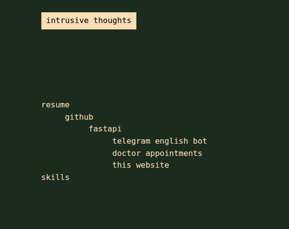

# resume fastapi project

2. [description](#1-Description)
3. [env vars](#2-env-vars)
4. [endpoints](#3-endpoints)
5. [diagrams](#4-diagrams)

## 1. Description

Yet another microservice for resume project


<div style="display: flex; flex-direction: column;">
    
    
</div>

cool features:
recursive cte for categories:

```postgresql
SELECT id,
       name,
       parent_id,
       0          AS level,
       ARRAY [id] AS path
FROM category
WHERE parent_id IS NULL
```

recursive part:
In first place we're getting the root elements.
Starting from the root elements, we recurse down to the leaves of the tree.
At the same time, a `path` is formed — an array containing the path from the root to the current element.

```postgresql
SELECT c.id,
       c.name,
       c.parent_id,
       ct.level + 1,
       ct.path || c.id
FROM category c
         JOIN "CategoryTree" ct ON c.parent_id = ct.id
```

We store the result of this query in redis until the data changes.
When deleting, changing, or adding, the cache is cleared with `@delete_cache `decorator.
You can check out db listeners in `server/alembic/versions/7b7f20cf8099_.py` migration.

Some `makefile`commands. You can use any with simple `make` command. Just type `make run` or smth

| Название команды | Краткое описание                                    |
|-----------------:|:----------------------------------------------------|
|              run | run redis and db in compose; run server locally     |
|             lint | check isort, black, flake8                          |
|             test | run tests                                           |
|          migrate | migrate all new stuff in versions folder to your db |
| create migration | create migration file based on your schema          |
|               up | up compose file                                     |
|             down | down compose file                                   |

## 2. env vars

|  env vars/secrets | default value        | Brief description                            |
|------------------:|:---------------------|----------------------------------------------|
|           DB_HOST | db                   | address of db (or just name in compose file) |
|           DB_PORT | 5432                 | db port                                      |
|       POSTGRES_DB | dbname               | db name                                      |
|     POSTGRES_USER | username             | db user                                      |
| POSTGRES_PASSWORD | password             | db password                                  |
|         REDIS_URL | redis://redis:6379/0 | redis address                                |
|  STATIC_DIRECTORY | server/static        | static folder                                |

## 3. endpoints

- `GET /health` - check is server all right;
- `GET /` - category tree;
- `GET /category/{category_id}` - category page or link or nothing actually;
- `POST /add` - add new category;
- `POST /category/{category_id}/update` - update category name;
- `POST /category/{category_id}/delete` - delete category, cascade all children;

## 4. diagrams

architecture `/diagrams/architecture.png`  
er `/diagrams/er.png`
